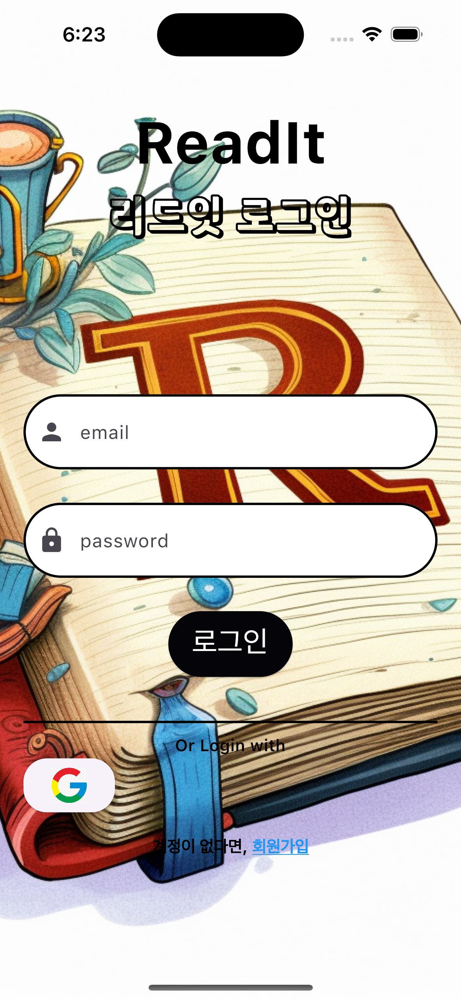
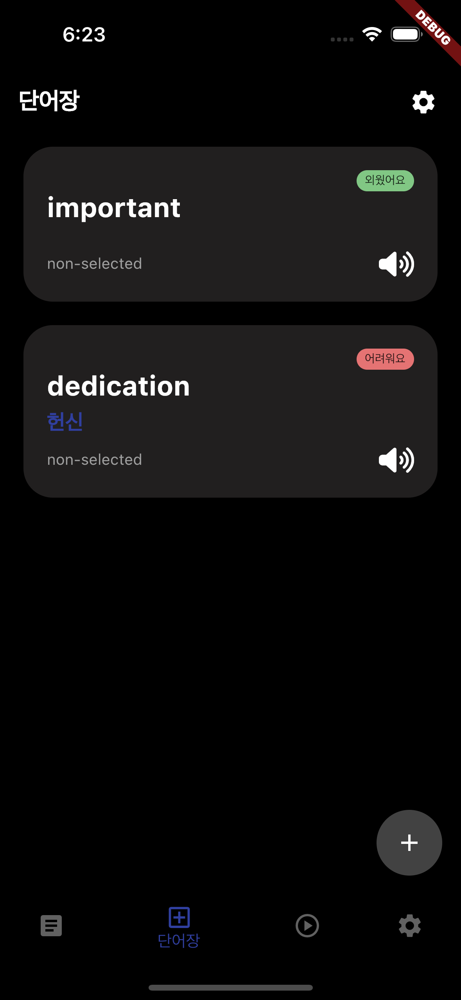
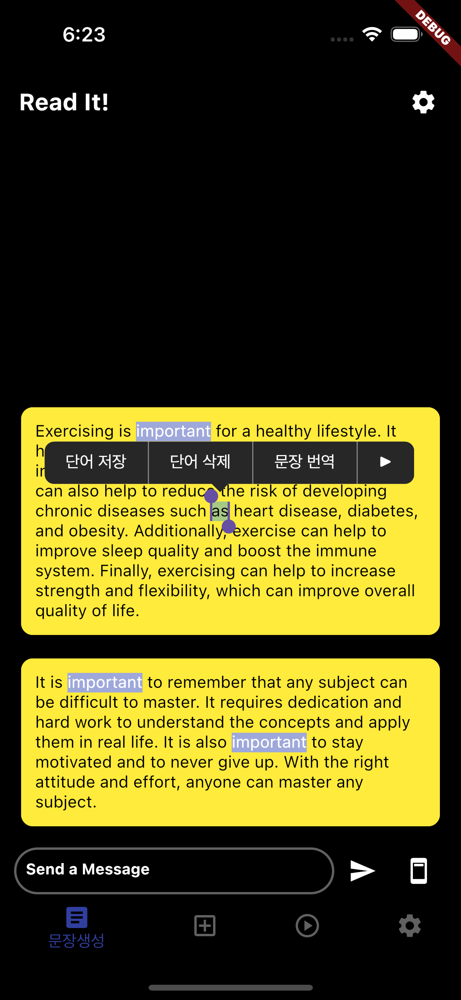

# READ IT!

It can help users memorize words more efficiently by creating reading sentences and problems based on words to memorize, a word memorization service made with chatgpt api.

## Purpose

This project is for Natural language generation application to help you memorize words

this application helps people memorize easily through reading sentences made by AI.

The sentences made are made of highlighted words that the user has not memorized or wants to memorize.

It promotes deeper understanding of words and sentence structures by directly reading and understanding sentence structures through word appearance algorithms.

## application features
- Create sentences based on stored words
- It is possible to save and delete words in a personal vocabulary by pressing them long in a sentence
- You can see the meaning of the word in your personal vocabulary, and it is classified into groups and whether you memorized it.
- An example sentence can be generated based on a word to solve a problem generated by a gpt model for words registered by a user.

